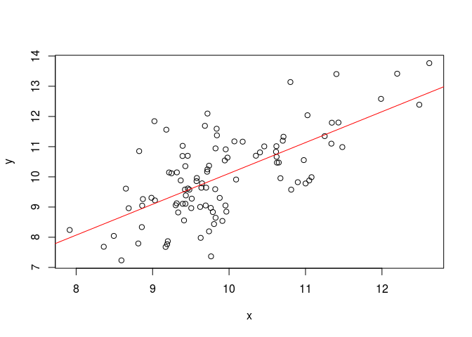

Bayesian linear regression
================
Lukasz Telezynski
2017-01-14

blm package
===========

Description
-----------

blm is a R package that can be used to fit bayesian linear models. It creates blm objects and is very similar to lm().

Usage example
-------------

First blm package needs to be loaded into R.

``` r
library(blm)
```

We need some data so we generate a dataset with 2 variables x and y.

``` r
x <- stats::rnorm(100, 10, 1)
y<- stats::rnorm(100, x, 1)
fit<-blm(y~x,1,1)
```

Finally, we can create blm object which fits linear model to our data with one explanatory variable x and response y.

``` r
fit<-blm(y~x,1,1)
```

Now we can print some information about our fitted model,

``` r
summary(fit)
```

    ## 
    ## Call:
    ## blm(y ~ x, 1, 1)
    ## 
    ## Residuals:
    ##         Min          1Q      Median          3Q         Max 
    ## -2.72205604 -0.55677026  0.02456043  0.55231446  2.52251160 
    ## 
    ## Coefficients:
    ##              Estimate Low 95% CI Upp 95% CI
    ## (Intercept) 0.4838183 -0.5269846  1.4946212
    ## x           0.9524575  0.9420190  0.9628959
    ## 
    ## Residual standard error: 0.9692381 on 98 degrees of freedom
    ## R-squared: 0.4494161 ,   Adjusted R-squared:  0.4437979
    ## F-statistic: 87.72309 on 1 and 98 DF, p-value:  2.877515e-15

or plot some data

``` r
plot(fit)
```



Installation
------------

Since blm package is available only through github, devtools package can be used to install it.

1.  Install and load devtools package (ommit installation if already installed)

    ``` r
    install.packages("devtools")
    library(devtools)
    ```

2.  Install blm package using devtools

    ``` r
    install_github("lttelezynski/blm")
    ```

Functions
---------

1.  blm() Constructor creating object of class blm with a fitted model. Requires data and formula in format response~explanatory.

2.  coefficients() Given blm object as an argument, returns its coefficients.

3.  confint() Given blm object as an argument, returns confidence intervals of coefficients.

4.  deviance() Given blm object as an argument, returns sum of squared distances between observed and predicted response variables.

5.  fitted() Given blm object as an argument, returns its fitted values.

6.  plot() Given blm object as an argument, plots data and regression line for datasets with only one explanatory variable.

7.  predict() Given blm object as an argument, returns predictions of response variable. New data can be passed through ... argument.

8.  print() Given blm object as an argument, prints out function call and coefficients.

9.  residuals() Given blm object as an argument, returns residuals - differences between observed and fitted values of response variable.

10. summary() Given blm object as an argument, returns summary about fitted model.

-   Function call
-   Residuals (Min, 1Q, Median, 3Q, Max)
-   Coefficients (Estimate with 95% confidence intervals)
-   Residual standard error
-   R² and Adjusted R²
-   F-statistic and p-value
